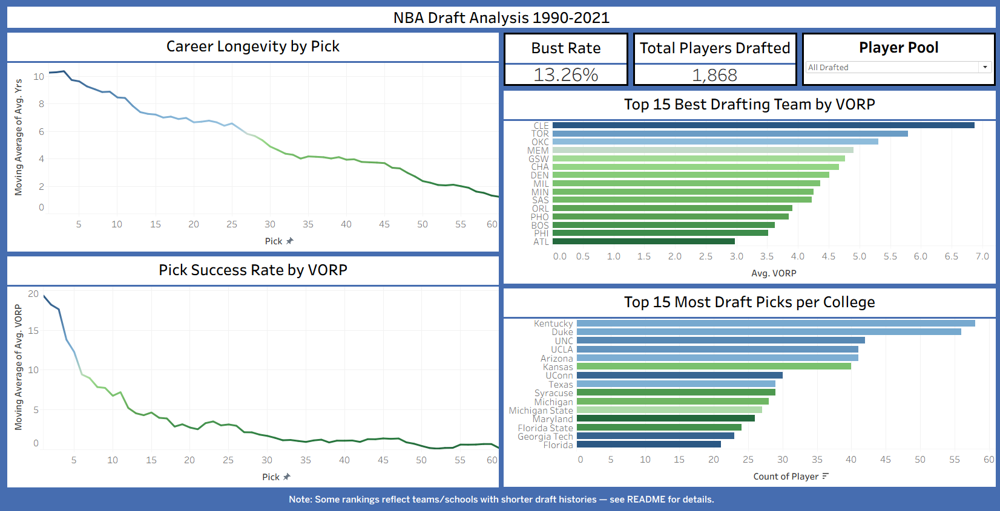

# NBA Draft Analysis (1990-2021)

Interactive Tableau dashboard analyzing 32 years of NBA draft data: career longevity by pick, value produced per pick, team drafting performance, and college pipeline strength.

**Live Dashboard:** [View on Tableau Public](https://public.tableau.com/app/profile/james.stendebach/viz/NBADashboard_17868271458110/NBADraftAnalysis1990-2021)

---

## Data Source

"20 Years of NBA Draft Data," a Kaggle dataset by [benwieland](https://www.kaggle.com/datasets/benwieland/nba-draft-data), covering NBA draft picks from 1990 to 2021, including player, team, college, and career statistics (years played, VORP, Win Shares, PPG, RPG, and more).

## Tools

- Tableau: data visualization, calculated fields, parameters, table calculations, dashboard design

## Key Findings

**1. Career longevity drops sharply after the lottery.**
Average years played falls off steeply over roughly the first 14 picks, then continues a longer, gentler decline through the rest of the first round before flattening out in the 30s through 60s, where most picks never play meaningful NBA minutes.

**2. Draft value (VORP) is even more front-loaded than career length.**
Average Value Over Replacement Player by pick drops off faster than years played, which means early picks aren't just more likely to stick in the league. They're disproportionately more likely to become genuinely impactful players. By the second round, average value is close to zero.

**3. Some of the best-ranked "drafting teams" are simply younger franchises.**
Teams like OKC (est. 2008, relocated from Seattle) and MEM (est. 2001, relocated from Vancouver) rank near the top on average VORP per pick. That's likely more about their shorter draft history than uniformly better drafting. Fewer years in the league means less chance for strong and weak draft classes to average each other out, while longer-tenured franchises have decades of both good and bad cycles pulling their average toward the middle.

**4. A handful of college programs produce a disproportionate share of NBA talent.**
Kentucky, Duke, UNC, UCLA, Arizona, and Kansas each produced 40+ drafted players over this period, well ahead of the rest of the field. This view reflects the NCAA pipeline specifically. Players with no recorded college (international draftees, and pre-2006 high-school-to-pro picks) were left out of this ranking, since lumping them into one large "no college" group would have skewed the comparison.

## Dashboard Features

- **Player Pool parameter:** toggle between "All Drafted" and "Played in NBA Only" across every chart, which surfaces the gap between total picks made and picks that actually turned into NBA contributors (bust rate)
- **Moving average smoothing** on both line charts to show the underlying trend without pick-to-pick noise drowning it out
- **Value-encoded color** on the bar charts, where shading reflects average VORP, adding a second data dimension without needing a second chart
- **Interactive tooltips** with supporting context (like total pick count) so no single ranking gets read in isolation

## Notable Data Handling Decisions

- `Yrs` and `VORP` were originally stored as text because of "NA" placeholder values for players who never played. Both were converted to numeric types, and a zero-filled version of each was created so the "All Drafted" view actually reflects bust rate (Tableau's `AVG()` quietly ignores nulls otherwise)
- Null career stats were treated as a real signal (drafted, but never played a game), not a data quality problem. This was confirmed against the dataset's own documentation before building anything on top of it
- `Pk` was set as a continuous dimension rather than a measure, so each pick plots individually instead of getting summed together

## How to Use

Open the [live dashboard](https://public.tableau.com/app/profile/james.stendebach/viz/NBADashboard_17868271458110/NBADraftAnalysis1990-2021), use the Player Pool dropdown in the top right to switch between all drafted players and NBA-only players, and hover over any bar or line point for pick-level detail.
